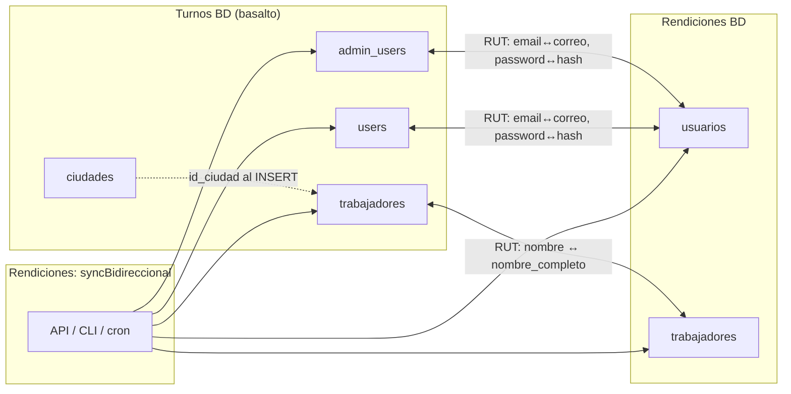

# Sincronización bidireccional — Basalto Rendiciones ↔ Basalto Turnos

Documento operativo/técnico desde el lado de **Basalto Rendiciones**. Describe qué hace el sync implementado en este repo y qué se espera de la BD/aplicación **Turnos**.

**Código fuente de verdad:** `server/src/utils/syncBidireccional.js`  
**Referencias cortas:** `DEPLOY.md` (notas sync).  
**Nota:** `docs/REGLAS_SISTEMA_Y_BD.md` no tiene sección de sync; solo indica que el JWT de Rendiciones es independiente del de Turnos.

> **Estado (jul 2026):** sync bidireccional **activa** por defecto (API y CLI). Para desactivar temporalmente: `SYNC_BIDIRECCIONAL_ENABLED=0` en `server/.env`.

---

## 1. Propósito

Mantener alineados, por **RUT** (clave de cruce normalizada), el personal y las credenciales entre:

| Turnos (`basalto`) | Rendiciones |
|--------------------|-------------|
| `admin_users` | `usuarios` (roles admin) |
| `users` | `usuarios` (`USER_RENDIDOR`) |
| `trabajadores` | `trabajadores` |

### Qué SÍ se sincroniza

- **Existencia** de filas (altas en un lado → altas en el otro, según reglas abajo).
- **Usuarios (campos comunes en UPDATE):** `email` ↔ `correo`, `password` ↔ `password_hash`.
- **Trabajadores (campos comunes en UPDATE):** nombre (`nombres` + apellidos ↔ `nombre_completo`).
- **Vínculo** `usuarios.trabajador_id` en Rendiciones cuando falta o el nombre está vacío (“Sin nombre”).
- **Mapeo de rol** en altas Turnos → Rendiciones (y `es_super_admin` en altas Rendiciones → Turnos `admin_users`).

### Modelo de roles (importante)

| Sistema | Modelo |
|---------|--------|
| **Rendiciones** | `trabajadores` = ficha de la persona. `usuarios` añade rol (`ADMIN_*` o `USER_RENDIDOR`). Admin y rendidor **no** coexisten. |
| **Turnos** | `admin_users` **XOR** (`trabajadores` + `users`). Un admin **no** necesita (ni debe) aparecer como trabajador. |

Por eso: la ficha `trabajadores` de un **admin** en Rendiciones **no** se copia a `trabajadores`/`users` de Turnos. Solo se crea/actualiza `admin_users`.
### Qué NO se sincroniza

- **`activo` (Turnos) ↔ `estado` (Rendiciones).** Las desactivaciones **no** se propagan.
- Soft delete / `is_deleted` / `deleted_at` de Rendiciones (Turnos no usa ese modelo en este sync).
- Roles ya existentes (un UPDATE de usuario no cambia `rol` ni `es_super_admin`).
- `cargo` de Rendiciones ↔ cargos/grupos de Turnos.
- `email` / `telefono` de `trabajadores` en Turnos ↔ fichas de Rendiciones (trabajadores Rendiciones no tienen esos campos en el modelo sync).
- JWT, sesiones, cajas, rendiciones, anticipos, faenas, turnos laborales, etc.
- Filas soft-deleted en Rendiciones (`is_deleted = TRUE`) — no se cargan ni se reactivan desde el sync.

---

## 2. Desde Rendiciones (este lado)

### 2.1 Cómo se dispara

| Canal | Detalle |
|-------|---------|
| **API** | `POST /api/admin/sync-bidireccional` — solo roles `SUPER_ADMIN_DEV` y `SUPER_ADMIN` (`checkRole(SUPER_ADMINS)`). Body o query opcional: `{ "dryRun": true }` / `?dryRun=true`. |
| **CLI** | `cd server && node scripts/sync-bidireccional.js` o con `--dry-run`. Carga `server/.env`. |
| **Cron (ejemplo en script)** | Diario 3:00 → mismo CLI, log a archivo (ruta de ejemplo en comentario del script). |
| **UI** | Existe cliente `syncBidireccional()` en `src/api/resources.js`. **No hay botón/pantalla** en el front que lo invoque (a fecha de este doc). |

Cada corrida vía API deja traza en `audit_logs` (módulo `Sync`, acción `MODIFICAR`).

### 2.2 Configuración (`TURNOS_DB_*`)

Pool: `server/src/config/dbTurnos.js`.

| Variable | Fallbacks | Default |
|----------|-----------|---------|
| `TURNOS_DB_HOST` | `DB_TURNOS_HOST` → `DB_HOST` | `127.0.0.1` |
| `TURNOS_DB_PORT` | `DB_TURNOS_PORT` → `DB_PORT` | `3306` |
| `TURNOS_DB_USER` | `DB_TURNOS_USER` → `DB_USER` | `root` |
| `TURNOS_DB_PASS` | `TURNOS_DB_PASSWORD` / `DB_TURNOS_PASS` / `DB_TURNOS_PASSWORD` / `DB_PASS` / `DB_PASSWORD` | `''` |
| `TURNOS_DB_NAME` | `DB_TURNOS_NAME` / `TURNOS_DB` | `basalto` |

La BD de Rendiciones sigue usando las variables normales (`DB_*` del pool principal). El sync abre **dos** conexiones.

> `server/.env.example` actual **no** documenta aún `TURNOS_DB_*` (sí están en `DEPLOY.md`).

### 2.3 Dry-run

Con `dryRun: true` / `--dry-run`:

- **No escribe** en ninguna BD.
- Solo cuenta filas y devuelve `preview` (`turnos_admins`, `turnos_users`, `turnos_trabajadores`, `rendiciones_usuarios`, `rendiciones_trabajadores`).
- **No** simula altas/updates ni lista RUT que cambiarían.

### 2.4 Tablas y campos mapeados

**Clave de cruce:** RUT normalizado (sin puntos, guión ni espacios; mayúsculas). En Rendiciones se guarda limpio; en Turnos `users`/`trabajadores` suelen usar formato `12345678-9` al insertar.

#### Usuarios

| Turnos | Rendiciones | Notas |
|--------|-------------|--------|
| `admin_users.RUT` | `usuarios.rut` | Admin Turnos |
| `users.rut` | `usuarios.rut` | Operador/rendidor; se ignora si ya hay `admin_users` con el mismo RUT |
| `email` | `correo` | UPDATE si difieren |
| `password` | `password_hash` | Se copia el hash **tal cual** (se asume formato compatible, p. ej. bcrypt) |
| `es_super_admin` | `rol` | Solo en **altas** |
| `activo` | `estado` | **No** se sincroniza |
| `updated_at` | `updated_at` | Resolución de conflictos |

**Mapeo de rol en altas:**

| Origen | Destino |
|--------|---------|
| Turnos `admin_users` con `es_super_admin = 1` | `SUPER_ADMIN` |
| Turnos `admin_users` con `es_super_admin ≠ 1` | `ADMIN_CAJA` |
| Turnos `users` | `USER_RENDIDOR` |
| Rendiciones `SUPER_ADMIN_DEV` / `SUPER_ADMIN` → Turnos `admin_users` | `es_super_admin = 1` |
| Rendiciones `ADMIN_CAJA` → Turnos `admin_users` | `es_super_admin = 0` |
| Rendiciones `USER_RENDIDOR` → Turnos `users` | (tabla `users`) |

Si falta password en Turnos al crear en Rendiciones, se genera un hash bcrypt de respaldo (`fallbackHash` sobre el RUT / `'changeme'`).

Si falta correo, se usa `{rut}@basalto.local`.

#### Trabajadores

| Turnos | Rendiciones | Notas |
|--------|-------------|--------|
| `RUT` | `rut` | |
| `nombres` + `apellido_paterno` + `apellido_materno` | `nombre_completo` | Único campo común en UPDATE |
| `email`, `telefono`, `activo`, `id_ciudad`, `id_faena`, … | — | No van a Rendiciones en UPDATE |
| — | `cargo` | No se escribe en Turnos en este sync |

**Alta Turnos ← Rendiciones** (`ensureTrabajadorTurnos`):

- `id_ciudad` = primer `id_ciudad` de tabla `ciudades` (obligatorio; falla si no hay filas).
- `id_faena = 1`
- `id_grupo` / `id_cargo` / `telefono` / `fecha_nacimiento` = `NULL`
- `es_usuario_test = 0`, `es_residente_local = 0`, **`activo = 1`**
- Si al crear un `users` hace falta FK, se crea antes el trabajador.

**Alta Rendiciones ← Turnos:** `INSERT` con `rut` limpio, `nombre_completo`, `cargo = NULL` (salvo caminos que reutilizan `ensureTrabajadorRendicion` con nombre).

### 2.5 Reglas de conflicto

Función `resolveWinner(turnosUpdatedAt, rendUpdatedAt)`:

1. Gana el `updated_at` **más reciente**.
2. Si `updated_at` es `NULL`/ausente/inválido → se trata como epoch (`0`) y **pierde** frente a un timestamp real.
3. **Empate** (mismo ms) → gana **Turnos**.

Aplica a:

- Diferencias de correo/password entre pares usuario.
- Diferencias de nombre entre pares trabajador.

### 2.6 Comportamiento en altas

| Dirección | Comportamiento |
|-----------|----------------|
| **Turnos → Rendiciones (usuario)** | Siempre `estado = 'inactivo'`. Un admin debe activarlo en Rendiciones para login. Si el usuario **ya existe**, el sync **no toca** `estado`. |
| **Turnos → Rendiciones (trabajador)** | Crea ficha; si ese RUT tiene `admin_users` o `users` en Turnos y aún no hay `usuarios` en Rendiciones, crea el usuario **inactivo**. |
| **Rendiciones → Turnos (usuario/admin)** | Inserta con **`activo = 1`**. No copia el `estado` de Rendiciones. Admin → solo `admin_users` (sin ficha `trabajadores`). |
| **Rendiciones → Turnos (trabajador)** | Inserta con **`activo = 1`** solo si el RUT **no** es admin en Rendiciones ni en Turnos. |
| **Admin vs user/trabajador en Turnos** | Exclusividad: `admin_users` **XOR** (`trabajadores` + `users`). Si existe `admin_users` para el RUT, no se crea vía `users`/`trabajadores`. Si el RUT ya es trabajador en Turnos, no se crea admin desde Rendiciones (error en stats). |

Orden de la corrida real (no dry-run): primero `syncUsuarios`, luego `syncTrabajadores`.

---

## 3. Cómo se espera que funcione en Turnos

El sync **lo ejecuta Rendiciones** (API/CLI contra ambas BD). Turnos no necesita un endpoint espejo en este diseño.

### 3.1 Qué debe exponer / mantener Turnos

| Requisito | Detalle |
|-----------|---------|
| **Tablas** | `admin_users`, `users`, `trabajadores`, `ciudades` (al menos una fila para `id_ciudad`). |
| **Columnas leídas/escritas** | Ver cabecera de `syncBidireccional.js` y consultas `loadTurnos*` / `INSERT`/`UPDATE` del mismo archivo. |
| **`updated_at`** | Debe existir y actualizarse en `admin_users`, `users` y `trabajadores` para que los conflictos tengan sentido. Sin él (o siempre NULL), Turnos suele “perder” o empatar de forma engañosa. |
| **Acceso DB** | Usuario MariaDB/MySQL alcanzable desde el servidor de la API de Rendiciones (`TURNOS_DB_*`). |
| **Hashes de password** | Mismo esquema que Rendiciones si se espera login cruzado con el mismo hash (hoy se copian bytes del string hash). **Asumido / por confirmar en Turnos.** |
| **FK `users.rut` → `trabajadores.RUT`** | El sync crea el trabajador antes del user cuando hace falta. |

### 3.2 ALTER `updated_at` (requisito previo)

Aplicar en la BD de **Turnos** (idempotente):

| Dónde | Comando / archivo |
|-------|-------------------|
| Repo Turnos | `npm run migrate:sync-updated-at` → `server/migrate/059_sync_updated_at.sql` |
| Repo Rendiciones (copia) | `server/scripts/sql/add_updated_at_turnos.sql` |

Luego, si hubo sync previos con exclusividad rota:

```bash
# En Turnos — dry-run
npm run cleanup:admin-trabajador-duplicates

# Aplicar: borra users duplicados y desactiva trabajadores de RUTs que ya son admin
npm run cleanup:admin-trabajador-duplicates -- --apply
```

### Checklist antes de reactivar el sync

1. Desplegar `syncBidireccional.js` (exclusividad admin XOR trabajador).
2. Correr `migrate:sync-updated-at` en Turnos.
3. Dry-run cleanup de duplicados; `--apply` si aparecen.
4. `node scripts/sync-bidireccional.js --dry-run` desde Rendiciones.
5. Sync real; revisar `stats.errores`.

### 3.3 Qué NO debe hacer Turnos (responsabilidades)

| Responsabilidad | Sistema |
|-----------------|---------|
| Ejecutar el job de sync | **Rendiciones** (CLI/API/cron) |
| Activar usuarios nuevos llegados desde Turnos | **Rendiciones** (nacen `inactivo`) |
| Desactivar en un sistema y esperar que el otro se desactive | **No soportado** — gestionar `activo`/`estado` por separado |
| Autenticación JWT compartida | **No** — JWT aislado (`REGLAS_SISTEMA_Y_BD.md` §1) |
| Sincronizar datos de negocio (turnos, faenas, cajas, gastos) | **Fuera de alcance** |

Turnos puede seguir creando/editando admins, users y trabajadores con normalidad; el próximo sync de Rendiciones reconciliará campos comunes y altas faltantes.

### 3.4 Ambiguo / por confirmar en Turnos

- Formato exacto de columnas y triggers de `updated_at` tras el ALTER faltante.
- Si `admin_users.RUT` se guarda con o sin guión (el INSERT desde Rendiciones usa RUT limpio; el match normaliza ambos).
- Política de `id_faena = 1` y “primera ciudad” al crear trabajadores desde Rendiciones (puede ser incorrecta para operación real).
- Compatibilidad real de algoritmos de hash entre ambos login.
- Si Turnos soft-borra o archiva personal de otra forma no contemplada aquí.

---

## 4. Flujo de datos



**Alta típica Turnos → Rendiciones (usuario):**

1. Existe en `admin_users` o `users`.
2. Sync inserta `trabajadores` (si falta) + `usuarios` con `estado='inactivo'`.
3. Un Super Admin / Admin Caja activa el usuario en Rendiciones cuando corresponda.

**Conflicto UPDATE:** compara `updated_at` → escribe solo en el lado perdedor los campos comunes.

---

## 5. Operación

### Dry-run

```bash
cd server
node scripts/sync-bidireccional.js --dry-run
```

O:

```http
POST /api/admin/sync-bidireccional
Authorization: Bearer <token Super Admin>
Content-Type: application/json

{ "dryRun": true }
```

Respuesta: `ok`, `dryRun: true`, `preview` con conteos, `stats` vacíos de mutaciones.

### Sync real

```bash
cd server
node scripts/sync-bidireccional.js
```

O el mismo `POST` sin `dryRun` / `dryRun: false`.

Respuesta: `stats.usuarios` / `stats.trabajadores` (contadores de creados/actualizados por lado) y `stats.errores[]` (strings).

CLI:

- Sin errores → exit `0`, log `[sync] OK`.
- Con errores parciales → exit `2` (igual puede haber aplicado parte de los cambios).
- Fatal → exit `1`.

### Logs y auditoría

- Consola / cron: stdout JSON del resultado; ejemplo de log en comentario del CLI.
- API: `console.error('[syncBidireccional]', …)` en 500; auditoría en módulo `Sync`.

### Troubleshooting breve

| Síntoma | Qué revisar |
|---------|-------------|
| Error de conexión | `TURNOS_DB_*`, firewall, que la API llegue al host de Turnos |
| `Turnos: no hay filas en ciudades` | Tabla `ciudades` vacía; no se puede INSERT trabajadores |
| Conflictos siempre a favor de un lado | `updated_at` NULL/ausente o sin `ON UPDATE` en Turnos |
| Usuario creado pero no puede entrar a Rendiciones | Nació `inactivo` — activar manualmente |
| Password no funciona en un lado | Algoritmo/hash incompatible (**por confirmar**) |
| Error FK al crear `users` | Falló `ensureTrabajadorTurnos` o RUT inconsistente |
| Dry-run “no muestra cambios” | Esperado: solo conteos, no diff |
| `add_updated_at_turnos.sql` no encontrado | Archivo en `server/scripts/sql/add_updated_at_turnos.sql` (o `npm run migrate:sync-updated-at` en Turnos) |
| Admin también aparece como trabajador en Turnos | Correr `cleanup:admin-trabajador-duplicates` en Turnos; el sync ya no crea esos duplicados |

---

## 6. Límites / no sincronizado (resumen)

- No `activo` ↔ `estado`.
- No soft deletes / reactivaciones cruzadas.
- No cambio de rol en UPDATEs.
- No cargo, teléfono, faena, ciudad, grupos (salvo defaults al INSERT en Turnos).
- No datos de negocio (cajas, gastos, anticipos, turnos).
- No JWT compartido.
- No UI de sync en el front (solo API + CLI).
- Dry-run no es un plan de cambios detallado.
- Usuarios soft-deleted en Rendiciones fuera del universo sync.
- Prioridad: si hay `admin_users` y `users` con el mismo RUT, manda el admin para el emparejamiento con `usuarios`.
- Exclusividad Turnos: admin XOR trabajador. Fichas `trabajadores` de admins en Rendiciones no se insertan en Turnos.
---

## Referencias de código

| Pieza | Ruta |
|-------|------|
| Lógica sync | `server/src/utils/syncBidireccional.js` |
| Pool Turnos | `server/src/config/dbTurnos.js` |
| Handler API | `server/src/controllers/admin.controller.js` → `syncBidireccionalHandler` |
| Ruta | `server/src/routes/admin.routes.js` → `POST /sync-bidireccional` |
| CLI | `server/scripts/sync-bidireccional.js` |
| Cliente front (sin UI) | `src/api/resources.js` → `syncBidireccional` |
| Notas deploy | `DEPLOY.md` (sección Sync Turnos ↔ Rendiciones) |
| SQL `updated_at` (referenciado, ausente) | `server/scripts/sql/add_updated_at_turnos.sql` |

---

*Documento generado a partir del código de Rendiciones. Cualquier divergencia con el esquema vivo de Turnos debe validarse allí y marcarse explícitamente.*
